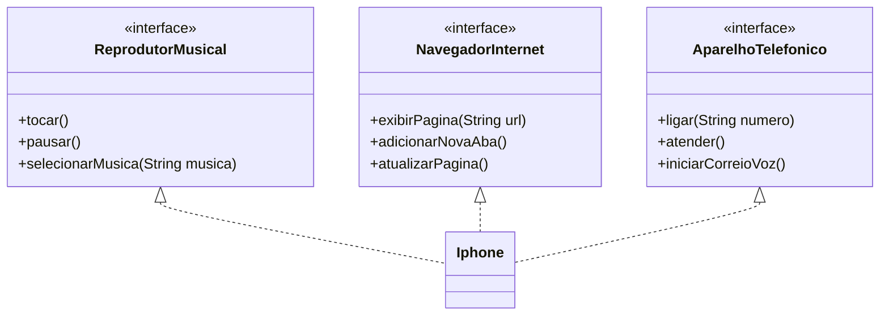

Modelagem e implementação das funcionalidades do iPhone utilizando Java e UML.

Funcionalidades modeladas:
- Reprodutor Musical
- Aparelho Telefônico
- Navegador na Internet

O iPhone implementa as três interfaces, concentrando todos os comportamentos do dispositivo.

